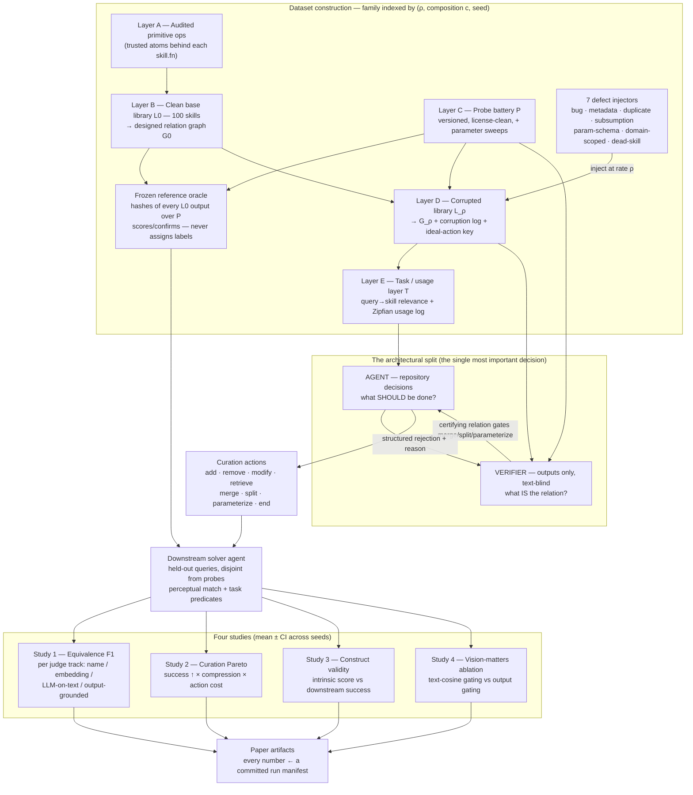
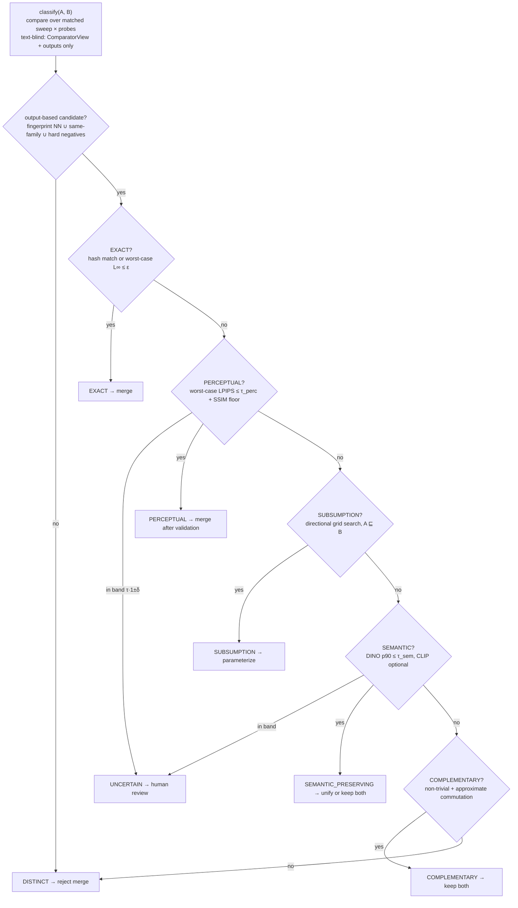
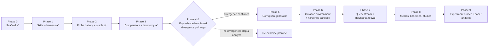

# VisCurate — pipeline diagrams (Mermaid)

Mermaid source for the whole project pipeline. Three views: the end-to-end data + method
flow (the spine), the output-grounded verifier's stop-at-first taxonomy, and the phase
roadmap. Renders on GitHub and at <https://mermaid.live>.

---

## 1. End-to-end pipeline (data + method flow — the spine)

---

## 2. The output-grounded verifier (stop-at-first taxonomy)

---

## 3. Phase roadmap (build order + status)

